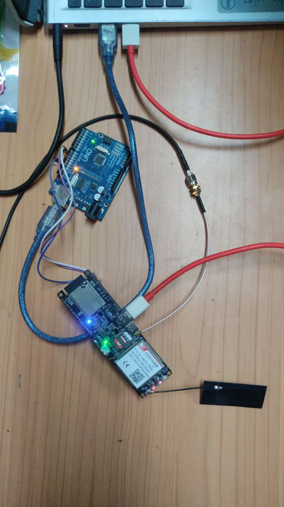
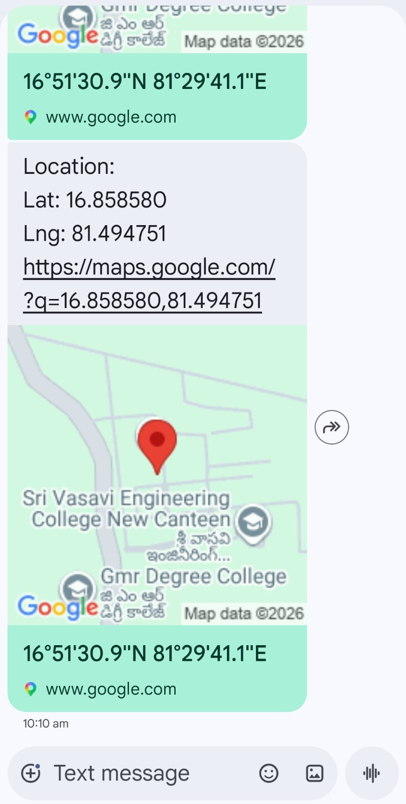

# 🚗 IoT-Based Vehicle GPS Tracking System

A real-time vehicle tracking system built using **Arduino Uno** and the **SIM7600E 4G LTE + GPS module**. The system periodically acquires GPS coordinates and sends the vehicle's location via SMS, including a direct Google Maps link for easy tracking.

---

## 📌 Objective

The goal of this project is to design and implement a low-cost, real-time vehicle tracking solution that can:

* Acquire GPS coordinates using the SIM7600E GNSS receiver.
* Convert raw GPS data into decimal-degree format.
* Send location updates through SMS.
* Provide a clickable Google Maps link.
* Operate without requiring internet access on the receiver's device.

---

## 🛠️ Tools & Technologies Used

| Category               | Details                        |
| ---------------------- | ------------------------------ |
| Microcontroller        | Arduino Uno (ATmega328P)       |
| Communication Module   | LilyGo SIM7600E (4G LTE + GPS) |
| IDE                    | Arduino IDE 1.8.19             |
| Programming Language   | Embedded C / Arduino (C++)     |
| Library                | SoftwareSerial                 |
| Communication Protocol | AT Commands                    |
| Network                | GSM/4G LTE                     |
| GPS Standard           | NMEA (DDMM.MMMM Format)        |
| Mapping Service        | Google Maps                    |

---

## ⚙️ System Overview

The Arduino communicates with the SIM7600E module using serial communication.

1. Initialize the SIM7600E module.
2. Enable the GPS engine using:

```cpp
AT+CGPS=1
```

3. Request GPS coordinates:

```cpp
AT+CGPSINFO
```

4. Receive latitude and longitude in DDMM.MMMM format.
5. Convert coordinates into decimal degrees.
6. Generate a Google Maps URL.
7. Send the location via SMS using:

```cpp
AT+CMGS
```

8. Wait for 60 seconds and repeat the process.

---

## 🔌 Circuit Connections

| Arduino Uno | SIM7600E |
| ----------- | -------- |
| Pin 10 (RX) | TX       |
| Pin 11 (TX) | RX       |
| 5V / VIN    | VCC      |
| GND         | GND      |

### Connection Diagram

```text
Arduino Uno                SIM7600E
-----------                --------
Pin 10 (RX)   <----------  TX
Pin 11 (TX)   ---------->  RX
5V/VIN        ---------->  VCC
GND           ---------->  GND
```

---

## 📲 Sample SMS Output

```text
Vehicle Location Update

Latitude: 17.3850
Longitude: 78.4867

Google Maps:
https://maps.google.com/?q=17.3850,78.4867
```

---

## 📁 Project Structure

```text
IoT-Vehicle-GPS-Tracker/
│
├── src/
│   └── Vehicle_GPS_Tracker.ino
│
├── circuit/
│   ├── wiring_diagram.png
│   └── hardware_setup.jpg
│
├── docs/
│   └── project_report.pdf
│
├── screenshots/
│   └── Google_Map_link.jepg
│
├── README.md
└── LICENSE
```

---

## 🚀 Features

* 📡 Real-time GPS location tracking
* 📩 SMS-based location updates
* 🗺️ Automatic Google Maps link generation
* 🔄 Automatic GPS retry mechanism
* 🧮 DDMM.MMMM to Decimal Degrees conversion
* 🛰️ 4G LTE connectivity through SIM7600E
* 🔋 Low-cost and portable solution
* 📱 Works with any mobile phone capable of receiving SMS

---

## 🧠 GPS Coordinate Conversion

The SIM7600E returns GPS coordinates in:

```text
DDMM.MMMM
```

Example:

```text
1723.1000
```

Conversion:

```text
Degrees = 17
Minutes = 23.1000

Decimal Degrees =
17 + (23.1000 / 60)

= 17.3850°
```

---

## 🚗 Applications

### Vehicle Theft Detection

Receive the vehicle's location if it is moved without authorization.

### Fleet Management

Monitor delivery vehicles, logistics fleets, and school buses.

### Personal Safety

Track personal vehicles, bags, or valuable belongings.

### Asset Tracking

Track equipment and cargo in remote locations.

### Emergency SOS Systems

Send location coordinates automatically during emergencies.

### Field Data Collection

Record and share geographic survey points.

---

## 🔮 Future Enhancements

* [ ] Web dashboard using Node.js and Leaflet.js
* [ ] Cloud integration with ThingSpeak
* [ ] Flutter mobile application
* [ ] Motion-triggered SMS alerts using accelerometer
* [ ] Geofencing support
* [ ] ESP32 migration for Wi-Fi and dual UART support
* [ ] Battery backup monitoring
* [ ] Real-time live tracking dashboard

---

## 📸 Project Demonstration

Add the following files:

* Hardware setup image
* Circuit diagram
* SMS output screenshot
* Project demonstration video

Example:

```markdown



```

---

## 🧪 Requirements

### Hardware

* Arduino Uno
* LilyGo SIM7600E Module
* SIM Card with SMS support
* Jumper Wires
* Power Supply

### Software

* Arduino IDE
* SIM7600E Drivers (if required)

---

## 📄 License

This project is licensed under the MIT License.

Feel free to use, modify, and distribute this project for educational and commercial purposes.

---

## 👨‍💻 Author

**Vinod Sanapala**

ECE Undergraduate
Embedded Systems | IoT | RF Engineering | Antenna Design


---

### ⭐ If you found this project useful, please give it a star on GitHub!
